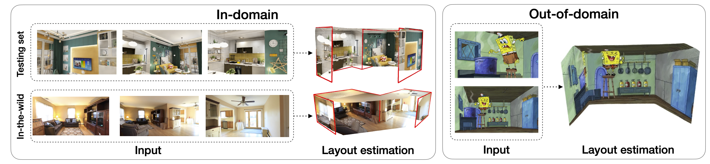
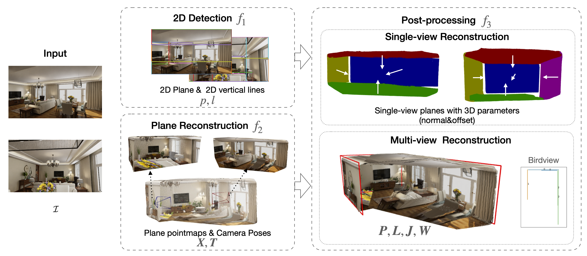
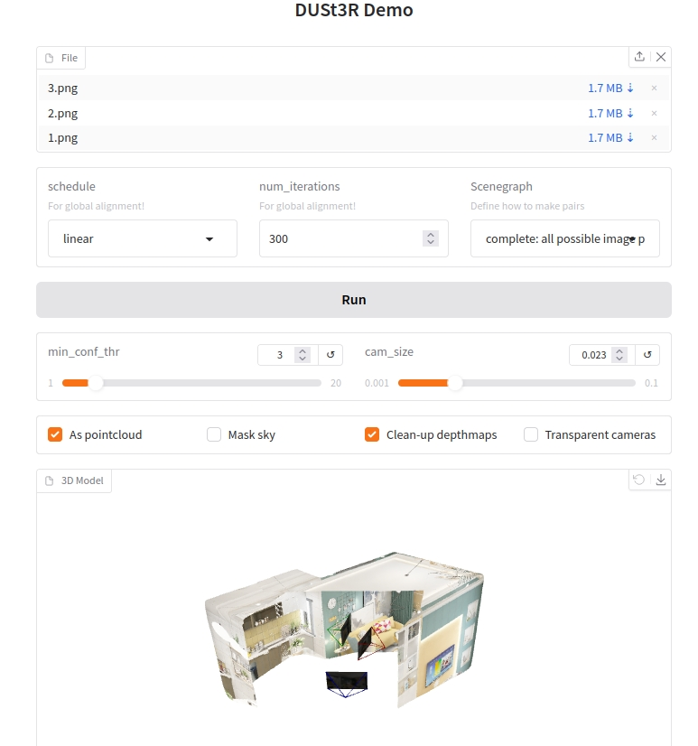

#  Plane-DUSt3R: Unposed Sparse Views Room Layout Reconstruction in the Age of Pretrain Model

This repository contains the official implementation of the paper "Unposed Sparse Views Room Layout Reconstruction in the Age of Pretrain Model". Accepted by ICLR 2025.
[[arXiv]](https://arxiv.org/abs/2502.16779)


## Overview

Plane-DUSt3R is a novel pipeline for multi-view room layout reconstruction from unposed sparse views. 

It combines single-view plane detection with multi-view 3D reconstruction method to achieve robust and accurate plane detection in indoor scenes.


## Get Started

### Installation

  

Create the environment, here we show an example using conda.

```conda create -n planedust3r python=3.11 cmake=3.14.0
conda activate planedust3r 
conda install pytorch==2.2.0 torchvision==0.17.0 torchaudio==2.2.0 pytorch-cuda=11.8 -c pytorch -c nvidia  # use the correct version of cuda for your system. test pass on pytorch 2.2.0
cd MASt3R
pip install -r requirements.txt
pip install -r dust3r/requirements.txt
```

Optional, compile the cuda kernels for RoPE (as in CroCo v2).

```
# DUST3R relies on RoPE positional embeddings for which you can compile some cuda kernels for faster runtime.
cd dust3r/croco/models/curope/
python setup.py build_ext --inplace
cd ../../../../
```

```
cd ..
pip install -r requirements.txt
```

### Checkpoints 
```
mkdir -p checkpoints/
```
And download the plane-dust3r checkpoints from the following link:
[plane-dust3r](https://drive.google.com/file/d/1sQ-IpRhfrPt4b1ZXhuPg2_dG1fnzo2SE/view?usp=sharing)

And download the noncuboid-dust3r checkpoints from the following link:
[noncuboid](https://drive.google.com/file/d/1DZnnOUMh6llVwhBvb-yo9ENVmN4o42x8/view?usp=sharing)

## Usage

### Interactive Demo

```
python3 MASt3R/dust3r/demo.py --weights checkpoints/checkpoint-best-onlyencoder.pth
# Use --weights to load a checkpoint from a local file
```



## Training

please see branch `train`

## Evaluation
### Data preparation
Please download Structured3D dataset from [here](https://structured3d-dataset.org/).

The directory should be like this:
```
root_path
└── scene_id_1
│   └── 2D_rendering
│       └── room_id_1
│           └── perspective
│               └── full
│                   ├── position_id_1
│                   │   └── rgb_rawlight.png
│                   ├── position_id_2
│                   │   └── rgb_rawlight.png
│                   └── ...
└── scene_id_2
    └── 2D_rendering
        └── room_id_2
            └── perspective
                └── full
                    ├── position_id_1
                    │   └── rgb_rawlight.png
                    ├── position_id_2
                    │   └── rgb_rawlight.png
                    └── ...
```
Since we use the plane depth to evaluate the performance, we need to convert the plane layout to plane depth map.
```
python convert_plane_depth.py --path /path/to/Structured3D/dataset
```

To evaluate on test set, run:
```
python evaluate_planedust3r.py \
    --dust3r_model checkpoints/checkpoint-best-onlyencoder.pth \
    --noncuboid_model checkpoints/Structured3D_pretrained.pt \
    --root_path /path/to/Structured3D/dataset \
    --save_path /path/to/save/result \
    --device cuda
```
The evaluation will create a folder in \$save_path\$ in the root directory, and save the results in `$save_path$/scene_number/room_id/`. If you dont want to save the results, you can set `--save_flag False`


## Citation
If you find this work useful in your research, please consider citing:
```
@misc{huang2025unposedsparseviewsroom,
      title={Unposed Sparse Views Room Layout Reconstruction in the Age of Pretrain Model}, 
      author={Yaxuan Huang and Xili Dai and Jianan Wang and Xianbiao Qi and Yixing Yuan and Xiangyu Yue},
      year={2025},
      eprint={2502.16779},
      archivePrefix={arXiv},
      primaryClass={cs.CV},
      url={https://arxiv.org/abs/2502.16779}, 
}
```


